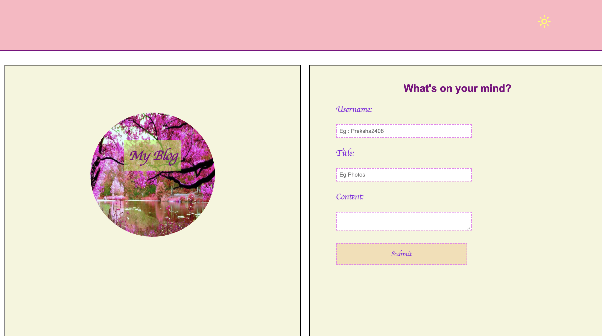
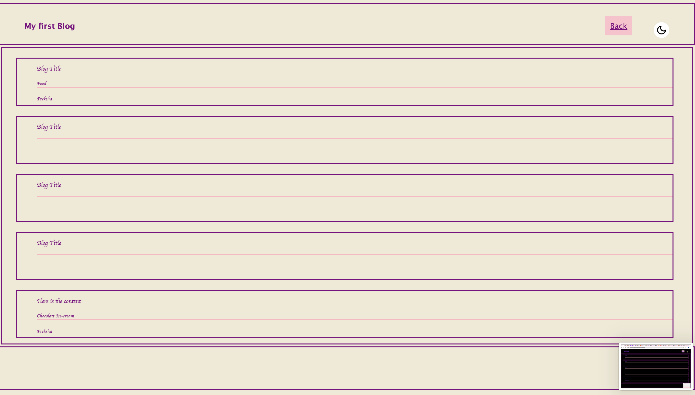
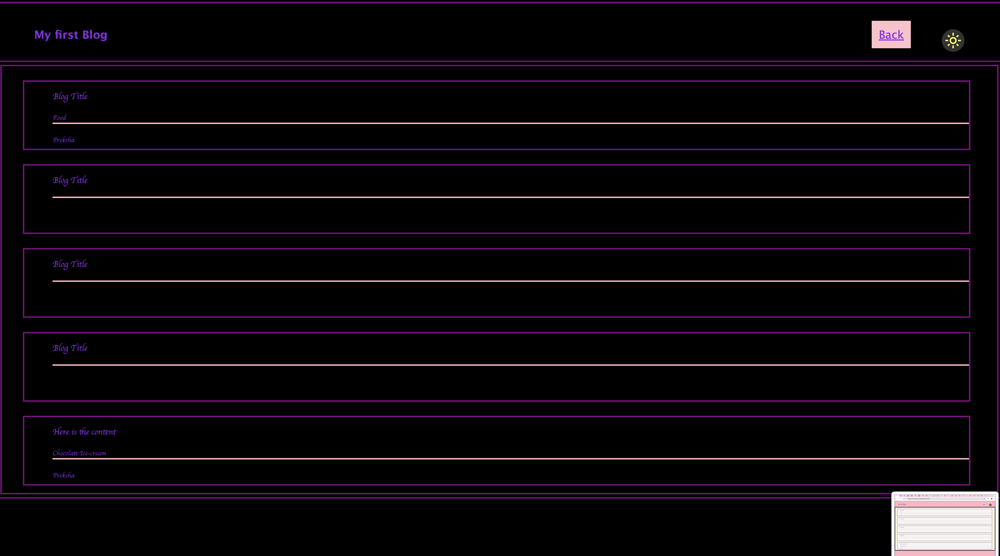

   
## My Blog Web Application 📝

## Overview 

This project is a simple web application named "My Blog" that allows users to enter username , title , content  and view it in the next blog page . It includes features like form submission, local storage of user inputs, and a theme toggle between light and dark modes.

## File Structure

* index.html
* blog.html
* assets/css/style.css
* assets/css/form.css
* assets/css/blog.css
* assets/js/form.js
* assets/js/logic.js
* assets/js/blog.js
* assets/js/theme-toggle.js

# screenshots 

Web-page 1 : ()

Web-Page 2 : 

Dark-Mode : 

Light Mode : 

# Link 

Deployed Application link : https://preksha2408.github.io/Myblog/

Git repository link :   https://github.com/Preksha2408/Myblog.git

# index.html
This is the main entry point of the application. It contains the structure of the home page, including:

A header section with an H1 tag.
A main section divided into one box and other form.
A form within the  board is for users to input their username, title, and content.
A button to toggle between light and dark themes, with an icon that changes based on the current theme.
References to external CSS and JavaScript files.

# style.css
The main stylesheet for the application, providing styles for:

Overall page layout and typography.
Header and main content area.
Control panel and mood board sections.
Light and dark themes, including background and text colors, borders, and transitions.

# form.css
Additional CSS to style the form within the box:
Input fields for the username, title, and content.
Submit button.

# blog.css
Styles specific to the blog section.
Layout and design for blog content.
Typography and spacing.

# form.js
JavaScript for handling form submission and interaction:
Form validation.
Submission logic.
Interaction with local storage.

# logic.js
JavaScript for managing application logic:
Rendering stored data from local storage.
Updating the UI based on stored entries.

# blog.js
JavaScript for handling blog-specific functionalities (assuming similar needs):
Loading and rendering blog posts.
Interactions related to blog content.

# theme-toggle.js

JavaScript for theme toggling functionality:
Handles the click event on the theme toggle button.
Toggles between light and dark themes by adding or removing a class from the body.
Updates the icon based on the current theme.

